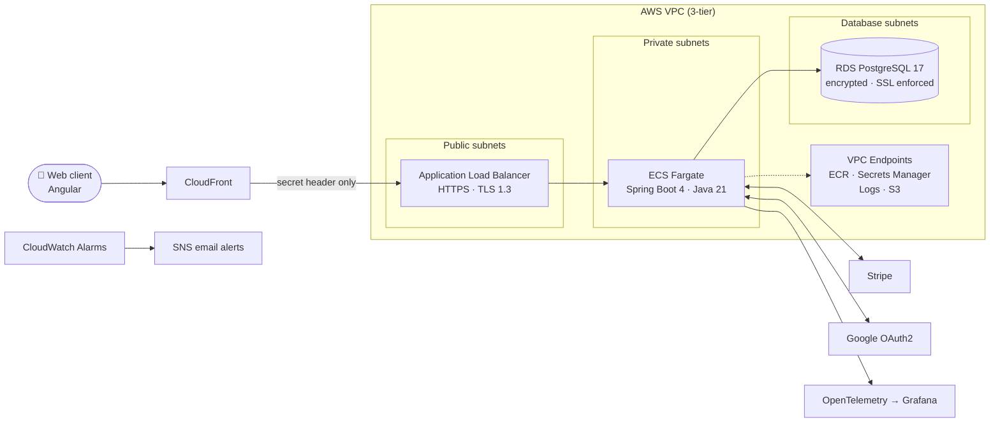
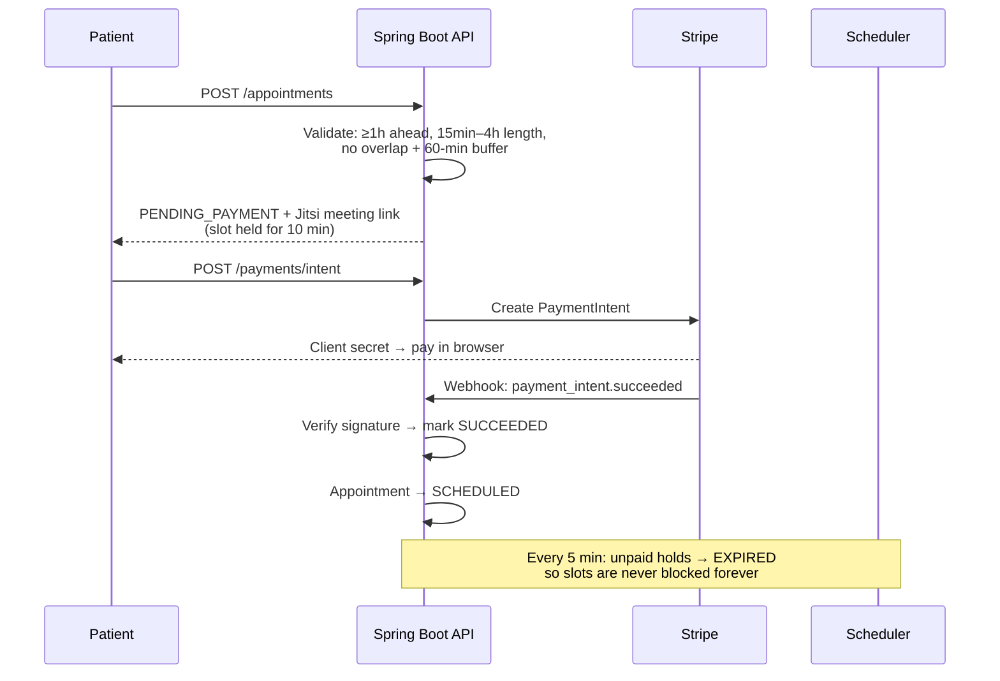

# Digital Health Platform

**A production-style telehealth backend: patients book a doctor, pay securely, and consult on video. I built the API, the pipeline, and the AWS infrastructure myself, from the first line of Java to the last line of Terraform.**


---

##  Why I built this

I didn't want another CRUD demo. I wanted to build something that has to work like a real product:

- Money moves, so payments must be correct and verified.
- Medical data is private, so access must be locked down by role.
- Slots are limited, so double booking must be impossible.
- Servers fail, so deployments must roll back on their own.

So I took one idea and built **every layer**: the business logic, the security, the database, the Docker image, the CI/CD pipeline, and the cloud infrastructure.

---

##  The 30-second summary

| What | Proof in this repo |
|---|---|
| **Backend depth** | 120+ Java classes, ~105 REST endpoints, clean layering (controller → service → repository → DTO → mapper) |
| **Security** | JWT + Google OAuth2, BCrypt, 88 method-level `@PreAuthorize` rules, 3 roles (Patient / Doctor / Admin) |
| **Payments** | Stripe PaymentIntents, **signature-verified webhooks**, refunds, invoices |
| **Business logic** | Conflict-free booking, 10-minute payment hold, auto-expiry scheduler, video link generation |
| **Database discipline** | 16 versioned Flyway migrations, `ddl-auto: validate`, Hibernate never touches the schema |
| **DevOps** | 4-stage Docker build, GitHub Actions → ECR → ECS, auto-rollback on failed deploys |
| **Cloud / IaC** | 16 Terraform files, 70+ AWS resources, 3-tier VPC, zero hardcoded secrets |
| **Observability** | OpenTelemetry traces, metrics and logs → Grafana, trace ID on every response, 6 CloudWatch alarms |

---

##  Architecture



**Design choices I'm proud of**

- **The app and the database never touch the public internet.** The ALB is the only public door. Tasks run in private subnets and the DB sits in its own isolated tier.
- **No NAT gateway.** I used VPC endpoints (ECR, Secrets Manager, CloudWatch Logs, SSM) plus an S3 gateway endpoint. Traffic stays on the AWS network, it's more secure, and it costs less.
- **The ALB only accepts traffic from CloudFront.** The listener returns `403` by default and forwards only when a secret header from Secrets Manager matches.
- **Each environment gets its own network range** (`10.1/2/3.0.0/16` for prod/staging/dev), so networks can be peered later without conflicts.

---

##  The core flow: booking an appointment



Appointment lifecycle: `PENDING_PAYMENT → SCHEDULED → COMPLETED` (or `CANCELLED`, `NO_SHOW`, `EXPIRED`).

---

##  What the platform does

-  **Auth**: email + password or **Sign in with Google**, stateless JWT, role-based access (Patient, Doctor, Admin).
-  **Doctors and patients**: profiles, specializations, license verification, blood group and genotype data, search and summaries.
-  **Appointments**: booking, rescheduling, cancel, complete, no-show, with rules enforced in the service layer.
-  **Payments and invoices**: Stripe checkout flow, refunds (successful payments only), invoice generation, overdue tracking.
-  **Consultations**: doctors record notes against an appointment, patients see their history, plus search, date-range and stats endpoints.
-  **Notifications**: async HTML emails via Thymeleaf templates.
-  **Password reset**: single-use code, 20-minute expiry, and the code is **stored hashed**, never in plain text.
-  **Profile pictures**: JPG/PNG only, random UUID filenames, path-normalised to block traversal.

---

##  Security

| Layer | What I did |
|---|---|
| Authentication | JWT (HS256, jjwt 0.12), the app refuses to start if the secret is under 32 chars |
| OAuth2 | Google login issues the JWT in an **HttpOnly, Secure** cookie |
| Account safety | Google accounts can't use the password flows, and the reset code is BCrypt-hashed, one-time and expires in 20 min |
| Authorization | Role checks **plus ownership checks**, e.g. a patient can only pay for their *own* appointment |
| Payments | Stripe webhook signature verified before any event is processed |
| Errors | Custom 401/403 handlers and a global exception handler, so no stack traces leak to clients |
| Containers | Non-root user (uid 1001), all Linux capabilities dropped, non-privileged |
| Secrets | Everything sensitive lives in **AWS Secrets Manager**, injected at runtime, none in the image or Terraform values |
| Data | RDS encrypted at rest, SSL forced (`rds.force_ssl`), S3 buckets encrypted with public access blocked |

---

##  DevOps and Infrastructure

### CI/CD (GitHub Actions)
```
push to develop  ──►  dev  environment
push to main     ──►  prod environment
```
Build JAR → build and push the image to **ECR** (tagged by git SHA) → `ecs update-service` → **wait until the service is stable**.
AWS access uses an IAM role, not static keys.

### Docker
A **4-stage multi-stage build**: dependency cache → build → Spring Boot **layer extraction** → minimal JRE-Alpine runtime. Rebuilds are fast because dependency layers rarely change. The image runs as a non-root user, has container-aware JVM flags (G1GC, `MaxRAMPercentage`), and a health check on the liveness probe.

### Terraform (everything is code, nothing was clicked in the console)

| Area | Resources |
|---|---|
| Network | VPC, public/private/database subnets, route tables, 6 interface endpoints, S3 gateway endpoint |
| Compute | ECS cluster, Fargate task + service, ECR with lifecycle policy |
| Traffic | ALB, HTTPS listener (TLS 1.3 policy), ACM certificate, Route 53 records, CloudFront-only rule |
| Data | RDS PostgreSQL 17.5 (gp3, encrypted, custom parameter group, `pg_stat_statements`) |
| Secrets & IAM | Secrets Manager, separate **execution role** and **task role** (least privilege) |
| Storage | S3 for uploads (versioned, lifecycle rules) and ALB logs |
| Alerting | 6 CloudWatch alarms → SNS email |

**Environment-aware by design.** One codebase, different behaviour via `locals`:

| | dev | prod |
|---|---|---|
| AZs | 2 | 3 |
| RDS Multi-AZ | ❌ | ✅ |
| Deletion protection | ❌ | ✅ |
| Backups | 1 day | 7 days |
| Container Insights / Performance Insights | off (save cost) | on |
| ECS Exec (debug shell) | ✅ | ❌ |

**Safe deployments:** a deployment **circuit breaker with automatic rollback**, 100% minimum healthy capacity, and a health-check grace period. A bad release never takes the site down.

**Alarms:** ECS CPU > 85%, running tasks < 1, ALB 5xx error rate, ALB p99 latency > 2s, RDS CPU > 80%, RDS free storage < 2 GB.

---

##  Observability

- **OpenTelemetry** for traces, metrics, and logs, exported over OTLP.
- Locally, `docker compose up` brings up **Grafana + Loki + Tempo + Prometheus** (`grafana/otel-lgtm`), so I can follow a single request across the whole system.
- Every HTTP response carries an **`X-Trace-Id`** header, so any user-reported error can be traced directly.
- Log lines include `[app, traceId, spanId]` for correlation.
- Spring Boot Actuator exposes liveness and readiness probes, used by both Docker and the ALB.
- Sampling is 100% in dev and 10% in prod.

---

##  Tech stack

| | |
|---|---|
| **Language / Framework** | Java 21, Spring Boot 4.0.1, Spring Web, Validation |
| **Security** | Spring Security, JWT (jjwt), OAuth2 Client (Google) |
| **Data** | Spring Data JPA, PostgreSQL 17, Flyway, HikariCP |
| **Cache** | Redis with per-entity TTLs (users 10 min, doctors 30 min and more) |
| **Payments** | Stripe Java SDK |
| **Mapping / Boilerplate** | MapStruct, Lombok |
| **Email** | Spring Mail, Thymeleaf |
| **Observability** | Actuator, Micrometer, OpenTelemetry, Grafana LGTM |
| **Infra** | Docker, Terraform, GitHub Actions, AWS (ECS Fargate, RDS, ALB, ACM, Route 53, CloudFront, ECR, S3, Secrets Manager, CloudWatch, SNS, IAM, VPC endpoints) |

---

##  Project structure

```
src/main/java/com/digitalhealth/platform/
├── appointment/     # booking rules, conflict check, expiry scheduler
├── billing/
│   ├── payment/     # Stripe PaymentIntents, refunds
│   ├── invoice/     # invoicing, overdue, mark-paid
│   └── controller/  # Stripe webhook
├── consultation/    # medical notes, history, stats
├── doctor/  patient/  role/  users/  notification/
├── common/
│   ├── security/    # JWT, filters, SecurityConfig
│   ├── exception/   # global error handling, OAuth2 handlers
│   ├── response/    # consistent ApiResponse wrapper
│   └── storage/     # safe file uploads
└── config/          # Redis cache, OpenTelemetry

src/main/resources/db/migration/   # V1 … V16 Flyway migrations
terraform/                         # full AWS infrastructure
.github/workflows/deploy.yml       # CI/CD pipeline
```

Every module follows the same shape: `controller → service → repository`, with `dto` and `mapper` keeping entities away from the API.

---

##  Run it locally

**You need:** Java 21, Docker.

```bash
# 1. Start Postgres, Redis and Grafana
docker compose up -d

# 2. Create your environment variables (never commit this file)
cp .env.example .env     # fill in your own Google, Stripe and mail keys

# 3. Run the app (dev profile is the default)
./mvnw spring-boot:run
```

- API: `http://localhost:8080`
- Health: `http://localhost:8080/actuator/health`
- Grafana: `http://localhost:3000`
- Flyway creates the schema and seeds the roles automatically on startup.

### Build the production image
```bash
docker build -t digital-health-platform .
```

### Deploy to AWS
```bash
cd terraform
terraform init
terraform apply -var-file="environments/dev/terraform.tfvars"
./build-and-push.sh v1.0.0 dev      # builds the image and pushes it to ECR
```

---

##  API at a glance

Base path: `/api/v1`. Roles are enforced on every route.

| Module | Examples | Who |
|---|---|---|
| **Users** | `POST /users/register` · `POST /users/login` · `POST /users/forgot-password` · `GET /users/me` | Public / Authenticated |
| **Appointments** | `POST /appointments` · `PUT /appointments/{id}/cancel` · `PUT /appointments/{id}/complete` | Patient · Doctor · Admin |
| **Payments** | `POST /payments/intent` · `POST /payments/{id}/refund` · `GET /payments/my-payments` | Patient · Admin |
| **Invoices** | `POST /invoices` · `GET /invoices/my-unpaid` · `GET /invoices/overdue` | Admin · Authenticated |
| **Consultations** | `POST /consultations` · `GET /consultations/my-history` · `GET /consultations/search` | Doctor · Patient |
| **Doctors / Patients** | `GET /doctors/summary` · `GET /doctors/search/specialization` · `GET /patients/me` | Mixed |
| **Billing webhook** | `POST /billing/webhook` | Stripe (signature-verified) |

---

##  What I'd build next

I know where the next improvements are, and I'd rather say so than hide it:

- [ ] Unit and integration tests with **Testcontainers** (the foundation is ready: a clean layered design plus a real Postgres in Compose)
- [ ] Account lockout after repeated failed logins (drafted in the user service, not switched on yet)
- [ ] Managed Redis (ElastiCache) in prod, plus enabling the cache layer there
- [ ] Remote Terraform state in S3 with DynamoDB locking (the backend block is ready to enable)
- [ ] Real in-app and SMS notifications (the enum and entity already support them)
- [ ] Open API / Swagger documentation

---

##  About me

I'm **Lokesh Kumawat**, a backend engineer who likes owning a feature from the idea all the way to production. I care about code that is readable, secure by default, and easy to deploy and debug.

 **Let's talk:** [LinkedIn](https://www.linkedin.com/in/lokesh-kumawat)  · lokeshkumawat0279@gmail.com

>  If this project helped or impressed you, a star on the repo means a lot.